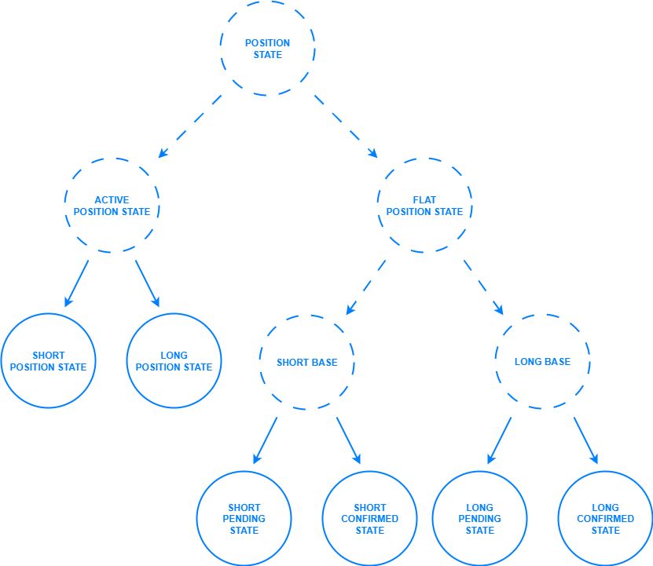
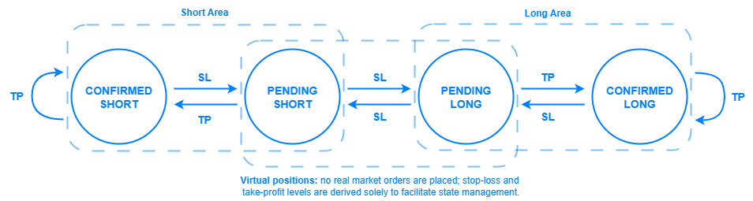
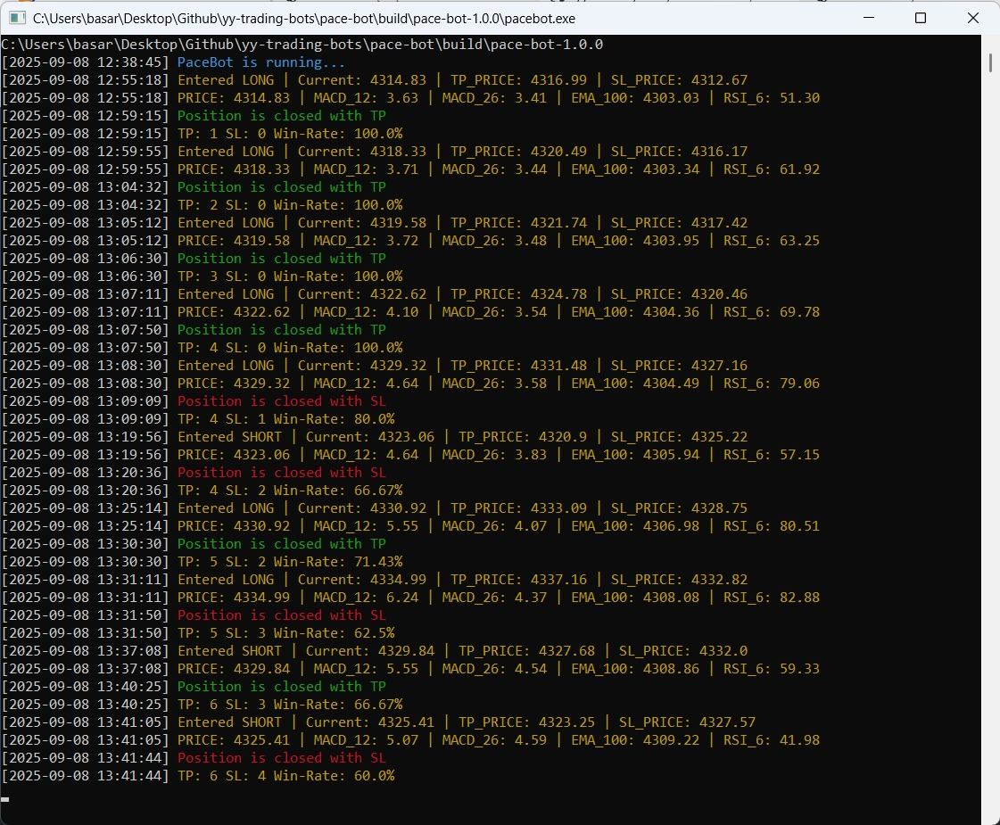

<div align="center">
  
</div>

[](https://www.python.org/downloads/)
[](#)
[](https://github.com/yy-trading-bots/pace-bot/actions/workflows/ci.yml)
[](https://github.com/yy-trading-bots/pace-bot/blob/master/LICENSE)

# PaceBot

> An automated cryptocurrency trading bot for Binance that uses a finite state machine (FSM) model to analyze past positions and predict the next move.

---

## 📖 Description

PaceBot is an automated crypto trading bot for Binance that operates with a finite state machine (FSM) model. It evaluates past positions and uses state transitions to estimate the next move, aiming to create a structured, adaptive trading flow. It uses clear abstractions with object‑oriented design and pragmatic design patterns to keep the codebase clean and maintainable without sacrificing functionality. The project also serves as a concise reference implementation for developers building their own trading bots.

---

## 🎯 Strategy

> **PaceBot** models trading as a **finite state machine (FSM)** implemented with the **State design pattern**. The bot’s **current state** is derived from the outcomes of **previous positions** (TP or SL). Each tick emits domain events that drive **deterministic state transitions**, allowing PaceBot to **anticipate the likely outcome of the next position** without relying on traditional technical indicators.

### State hierarchy (overview)

- **`PositionState` (root)** — Defines the abstract interface for all states and the entry method invoked on each iteration of the loop.
- **`FlatPositionState`** — Based on the current state, opens a new position; this may be a real (confirmed) position or a virtual (pending) one.
- **`ActivePositionState`** — Manages live orders: continuously monitors the market price against configured stop-loss (SL) and take-profit (TP) levels; when any condition is triggered, executes the predefined actions and closes the position.

<div align="center">
  
</div>

### State transitions

- **Virtual Positions (Pending)** — In `ShortPendingState` and `LongPendingState`, **no real market orders** are placed. The bot behaves **as if a position were open** and transitions to the corresponding `ActivePositionState`.
- **Confirmed Positions** — `ShortConfirmedState` / `LongConfirmedState` **place real market orders**.
- **Outcome Feedback** — When the market reaches the TP or SL price, the bot **is triggered** and transitions to the corresponding state.

State transitions are as follows:

<div align="center">
  
</div>

---

## ⚙️ Configuration

First, rename `settings.example.toml` to **`settings.toml`** and edit the fields to match your preferences.

| Key              | Section      |    Type |     Default | Description                                                                                   | Example              |
| ---------------- | ------------ | ------: | ----------: | --------------------------------------------------------------------------------------------- | -------------------- |
| `PUBLIC_KEY`     | `[API]`      |  string |        `""` | Your Binance API key. Grant only the permissions you actually need. **Do not commit to VCS.** | `"AKIA..."`          |
| `SECRET_KEY`     | `[API]`      |  string |        `""` | Your Binance API secret. Keep it secret and out of the repo.                                  | `"wJalrXUtnFEMI..."` |
| `SYMBOL`         | `[POSITION]` |  string | `"ETHUSDT"` | Trading symbol (e.g., USDT-M futures or spot pair).                                           | `"BTCUSDT"`          |
| `COIN_PRECISION` | `[POSITION]` | integer |         `2` | Quantity precision for orders. Must align with the exchange **lot size** rules.               | `3`                  |
| `TP_RATIO`       | `[POSITION]` |   float |    `0.0050` | Take-profit distance **relative to entry**. `0.0050` = **0.5%**.                              | `0.0100`             |
| `SL_RATIO`       | `[POSITION]` |   float |    `0.0050` | Stop-loss distance **relative to entry**. `0.0050` = **0.5%**.                                | `0.0075`             |
| `LEVERAGE`       | `[POSITION]` | integer |         `1` | Leverage to apply (for futures). Use responsibly.                                             | `5`                  |
| `TEST_MODE`      | `[RUNTIME]`  |    bool |      `true` | Paper/Test mode. When `true`, no live orders are sent (or a testnet is used).                 | `false`              |
| `DEBUG_MODE`     | `[RUNTIME]`  |    bool |     `false` | Verbose logging and extra assertions.                                                         | `true`               |
| `INTERVAL`       | `[RUNTIME]`  |  string |     `"15m"` | Indicator/candle interval (e.g., `1m`, `5m`, `15m`, `1h`, ...).                               | `"1h"`               |
| `SLEEP_DURATION` | `[RUNTIME]`  |   float |      `30.0` | Delay (seconds) between loops to respect API limits.                                          | `10.0`               |

**Where to get API keys:** Binance → **API Management**: [https://www.binance.com/en/my/settings/api-management](https://www.binance.com/en/my/settings/api-management)

> Tips
>
> - Keep `COIN_PRECISION` in sync with `exchangeInfo` (lot/tick size) to avoid rejected orders.

---

## ▶️ How to Run

> Ensure `settings.toml` is properly configured **before** running.

There are three ways to run the bot, and you may choose whichever best suits your needs.

### 1) Release

Download the latest release and run the executable.

### 2) Docker

```bash
# Build the image
docker build -t pacebot .

# Run (Linux/macOS)
docker run --rm \
  -v "$(pwd)/src:/app/src" \
  pacebot

# Run (Windows CMD)
docker run --rm \
  -v "%cd%\src:/app/src"
  pacebot
```

> The volumes mount your local `src/` for output log files.

### 3) Python (virtualenv)

```bash
# Create a virtual environment
python -m venv .venv

# Activate
# Linux/macOS
source ./.venv/bin/activate
# Windows CMD
.\.venv\Scripts\activate

# Install dependencies
pip install -r requirements.txt

# Run
python src/main.py   # direct module/script
```

---

Example terminal output:

<div align="center">
  
</div>

---

## ⚠️ Warnings

> **Disclaimer:** Trading cryptocurrencies — especially with **leverage** — involves **significant risk**. This bot is **not financial advice** and is provided for educational/experimental purposes only. Review the code and the strategy thoroughly, start small, and only trade with funds you can afford to lose. **All P\&L is your responsibility.**
>
> Protect your API keys, never commit secrets, and be aware of operational risks such as rate limits, network issues, exchange maintenance, and **slippage**, all of which can materially affect performance.
